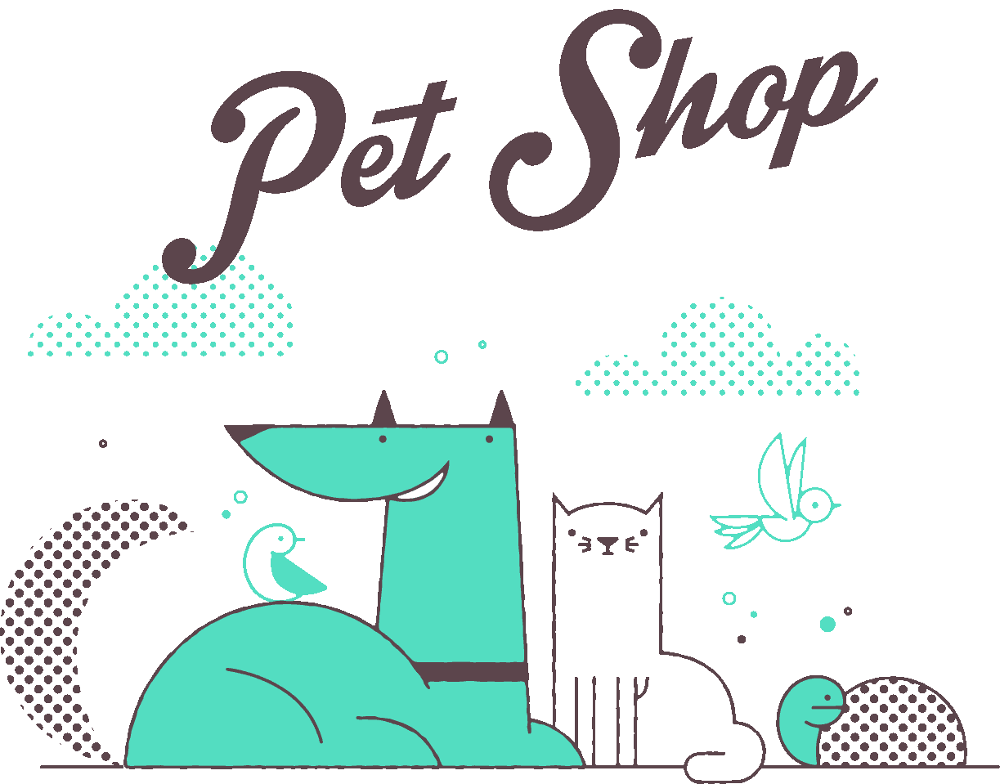
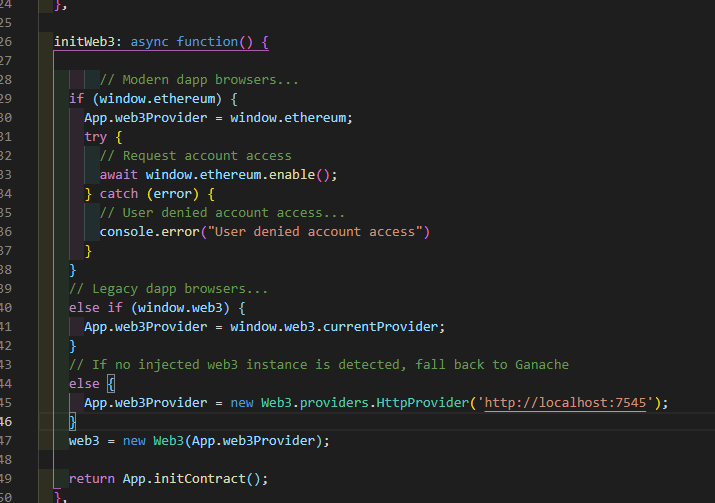

# SMART CONTRACTS # Solidity #Truffle 

Para esta practica es necesario tener instalado NodeJs, Ganache y Truffle, una vez los tengamos, en nuestro cmd ubicamos la direccion de la carpeta donde crearemos el prooyecto, ya que estan en la ubicacion escribiremos el siguiente comando "truffle unbox pet-shop" para extraer los archivos basicos de la petshop.

Ahora en nuestro editor, dentro de la carpeta "contracts" crearemos un archivo nuevo llamado "Adoption.sol" y escribiremos el siguiente codigo el cual contiene la variable con la que vamos a trabajar y la version de pragma.

Despues agregaremos 2 funciones:

1.- esta funcion nos permitira manejar las solicitudes de adopcion para las mascotas.
2.- esta funcion nos muestra a las personas que adoptan.

Procedemos a compilar nuestro codigo.

Una vez que se compilo correctamente, realizamos la migracion a blockchain, por lo que en nuestra carpeta "migrations" crearemos un archivo nuevo llamado "2_deploy_contracts.js".

Para poder realizar la migracion, ademas del codigo, necesitamos tener iniciado nuestro Ganache, volviendo a nuestro cmd ejecutaremos el comando "truffle migrate" lo cual nos mostrara la informacion de nuestros contracts y veremos como en ganache nos desconto el eth correspondiente a la creacion de esos contracts.

/// TESTEO ///

Vamos a verificar que funciona correctamente, para eso en nuestra carpeta "test" existen 2 formas de realizar el testeo, una mediante un archivo solidity y la otra usando un archivo javascript (ambas opciones son correctas y dan los mismos resultados), a continuacion se muestra el codigo de ambas opciones.

Para ejecutar el testeo, volvemos a nuestro cmd y escribimos el codigo "truffle test" mostrandonos que las funciones de nuestros test han pasado correctamente.

/// WEB3 ///

Ahora dentro de los archivos que nos genero automaticamente el unbox del pet-shop, nos dirigimos al archivo "app.js" que se encuentra en src/js/app.js, localizamos la parte del codigo que dice initweb3 y remplazamos el codigo por el siguiente:

De la misma manera reemplazamos el codigo que esta en initContract, en markAdopted y en handleAdopt:

